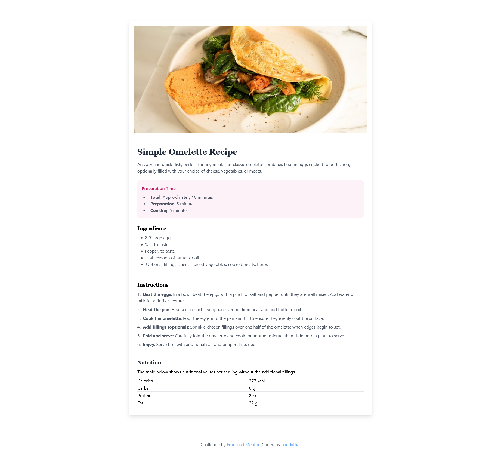

# Frontend Mentor - Recipe page solution

This is a solution to the [Recipe page challenge on Frontend Mentor](https://www.frontendmentor.io/challenges/recipe-page-KiTsR8QQKm). Frontend Mentor challenges help you improve your coding skills by building realistic projects.

## Table of contents

- [Overview](#overview)
  - [The challenge](#the-challenge)
  - [Screenshot](#screenshot)
  - [Links](#links)
- [My process](#my-process)
  - [Built with](#built-with)
  - [What I learned](#what-i-learned)
  - [Continued development](#continued-development)
- [Author](#author)
- [Acknowledgments](#acknowledgments)

## Overview

Responsive recipe page using Tailwind CSS.

### The Challenge

Trying Tailwind CSS was overwhelming and applying classes was challenging. Applying colors other than custom colors was not able to apply using themes.

### Screenshot

### Links

- Solution URL: [Add solution URL here](https://www.frontendmentor.io/solutions/responsive-recipe-page-ylJnG_6SDN)
- Live Site URL: [Add live site URL here](https://nandiitha.github.io/recipe-page/)

## My process

### Built with

- Tailwind CSS

### What I learned

Tailwind CSS styling and classes.

### Continued development

While building this page, I came across an issue of not able to use customised colors in the project. I could not apply background colors and other color related styling.I will like to find a solution and use customised colors.

## Author

- Frontend Mentor - [@nandiitha](https://www.frontendmentor.io/profile/nandiitha)
